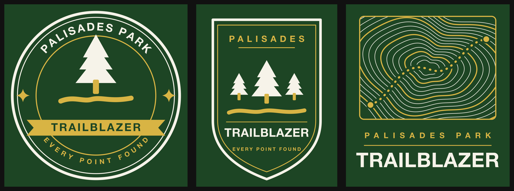

# Trailblazer T-shirt Artwork

Front-chest art for the shirt earned by reaching the top rank
(`TOP_TIER` in `src/data/collectibles.ts`). Three concepts, same palette,
pulled from the app icon and the rank certificate.



| File | Concept |
| --- | --- |
| `trailblazer-roundel.svg` | Circular badge — arced park name, evergreen, notched banner |
| `trailblazer-crest.svg` | Shield crest — three evergreens over the trail, stacked wordmark |
| `trailblazer-topo.svg` | Topographic map panel with a dashed route, wordmark below |

## Colors

Two inks on a forest-green shirt. No gradients, no halftones, no opacity —
everything is a solid spot color so this screen-prints as-is.

| Role | Hex | Notes |
| --- | --- | --- |
| Shirt | `#1D4524` | Matches the dark stop of the app-icon gradient |
| Ink 1 — cream | `#F6F3E9` | From `public/icons/icon.svg` |
| Ink 2 — gold | `#D8B444` | From `public/icons/icon.svg` |

`#1D4524` fills in the SVGs are **knockouts**, not a third ink: bare shirt shows
through (the roundel's banner wordmark, the topo route casing). If these are
printed on any other shirt color, those areas need to change to that color.

## Sizing

The SVGs are unitless and scale losslessly. For a standard adult front print,
scale the art to **11 in** wide and place the top edge 3 in below the collar
seam. Youth sizes: 8 in wide.

## Before sending to a printer

Text is still live text set in Helvetica Bold. Two things to do:

1. **Convert type to outlines.** Otherwise the shop's RIP substitutes a font
   and the metrics shift. In the roundel the arc lettering is already
   positioned per-glyph, so outlining will not move anything.
2. **Ask for a spot-color separation**, two screens, not CMYK process.

Arc lettering deliberately avoids `<textPath>` — support is uneven across
renderers and print RIPs, and it silently dropped in testing. Each glyph is an
individually rotated `<text>` positioned from real Helvetica Bold advance
widths.

## Regenerating

`trailblazer-crest.svg` is hand-authored; edit it directly. The other two are
generated, so edit the script and re-run:

```bash
node design/tshirt/gen-roundel.mjs design/tshirt/trailblazer-roundel.svg
node design/tshirt/gen-topo.mjs    design/tshirt/trailblazer-topo.svg
```

Preview on the shirt color with:

```bash
rsvg-convert -h 1100 -b '#1D4524' design/tshirt/trailblazer-roundel.svg -o /tmp/preview.png
```
